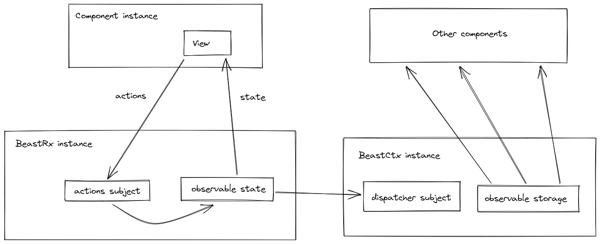

# BeastRx

🎉 Welcome to the **BeastRx** repository 🎉

**BeastRx** is an ultra-light Angular library that enables _full reactivity_ in _state management_.

👍 **No mutable state**  
👍 **Smart change detection**  
👍 **Fully declarative**  
👍 **100% reactive**  
👍 **Only 150 lines of code**

## Motivation

I always found `rxjs` a really powerfull tool in Angular, yet I find it a better solution at framework/library level than at application/consumer code level.  
On the other hand I like the fact that React hides so much complexity from the consumer code, but I really don't like the way hooks make function components _unpure_ and unpredictable.

So I decided to create a super-light library that implements a simple reactive pattern in Angular, which is already well integrated with `rxjs` but with fully **smart change detection** and **no mutable state** at all.

---



---

## Disable change detection

Angular normally runs change detection whenever _something_ happens inside the _ng zone_; this feature comes at a performance cost and causes change detection to be triggered even when not necessary. Since we're going full-reactive, we don't need Angular to look for changes in the application state. **BeastRx** is doing that instead, only when state _really_ changes (kinda like React does).

`main.ts`

```ts
platformBrowserDynamic()
  .bootstrapModule(AppModule, { ngZone: "noop" })
  .catch((err) => console.error(err));
```

## _Provide_ your **BeastRx** dependencies

Call the `provideBeastRx` function passing the `init` function, the _Feature Service_ and the _Context Key_.

`counter.component.ts`

```ts
@Component({
  selector: "[counter]",
  templateUrl: "./counter.component.html",
  styleUrls: ["./counter.component.css"],
  providers: provideBeastRx<CounterState, CounterFeature>(
    (rx) => rx.feature.reset,
    CounterFeature
  ),
})
export class CounterComponent {
  constructor(protected rx: BeastRx<CounterState, CounterFeature>) {}
}
```

`counter.feature.ts`

```ts
@Injectable()
export class CounterFeature {
  incrementBy: ActionFactory<CounterState, CounterFeature> =
    (event: Event) => () => ({
      incrementBy: (event.target as HTMLInputElement).valueAsNumber,
    });

  increment: Action<CounterState, CounterFeature> = ({ state }) => ({
    currentValue: state.currentValue + state.incrementBy,
  });

  reset: Action<CounterState, CounterFeature> = () => initialState;
}
```

> - The `init` function is just a function that returns the first _Action_ that will initialize state.
> - A _Feature Service_ is a simple class decorated with `@Injectable()`, in other words, an angular service that is not provided in root; it exposes all the _Actions_ or the _Action Factories_ that update state by returning a state patch (in this case a `Partial<CounterState>`).

---

See:

- [Counter](src/app/samples/counter/)
- [Edit form](src/app/samples/edit-form/)

## _Provide_ a root `BeastCtx`

With `BeastCtx` you can easily propagate your component state to a _bigger context_, so that it can be consulted elsewhere.

Call the `provideBeastCtx` function from a container component or module, then declare a _context type_ and a _context key_ for your component state.

`app.component.ts`

```ts
@Component({
  selector: "[app]",
  templateUrl: "./app.component.html",
  styleUrls: ["./app.component.css"],
  providers: provideBeastCtx(), // could also be provided in the AppModule
})
export class AppComponent {}
```

`counter.component.ts`

```ts
@Component({
  selector: "[counter]",
  templateUrl: "./counter.component.html",
  styleUrls: ["./counter.component.css"],
  providers: provideBeastRx<CounterState, CounterFeature, AppCtx>(
    (rx) => rx.feature.reset,
    CounterFeature,
    "counter"
  ),
})
export class CounterComponent {
  constructor(protected rx: BeastRx<CounterState, CounterFeature>) {}
}
```

## Update the state

Whenever you need to _change_ the state, you just push an `Action<State>` in the `rx.actions` subject. You can use the actions from the _Feature Service_ you provided (`rx.feature`).

```html
<ng-container *ngIf="rx.state | async as s">
  <p>Counter value: {{s.currentValue}}</p>
  <form>
    <label for="increment-by">Increment by</label>
    <input
      type="number"
      id="increment-by"
      [value]="s.incrementBy"
      (input)="rx.actions.next(rx.feature.incrementBy($event))"
    />
  </form>
  <div class="actions">
    <button (click)="rx.actions.next(rx.feature.increment)">Increment</button>
    <button (click)="rx.actions.next(rx.feature.reset)">Reset</button>
  </div>
</ng-container>
```

## Watch a context

If you want to read other parts of the application state, just inject the `BeastCtx` and use the `ctx.storage` property.

```ts
@Component({
  selector: "[summary]",
  templateUrl: "./summary.component.html",
  styleUrls: ["./summary.component.css"],
})
export class SummaryComponent {
  constructor(@Inject(CONTEXT) protected ctx: BeastCtx<AppCtx>) {}

  text(state: AppCtx): string {
    return JSON.stringify(state, null, "  ");
  }
}
```

```html
<ng-container *ngIf="ctx.storage | async as s">
  <pre>{{text(s)}}</pre>
</ng-container>
```
